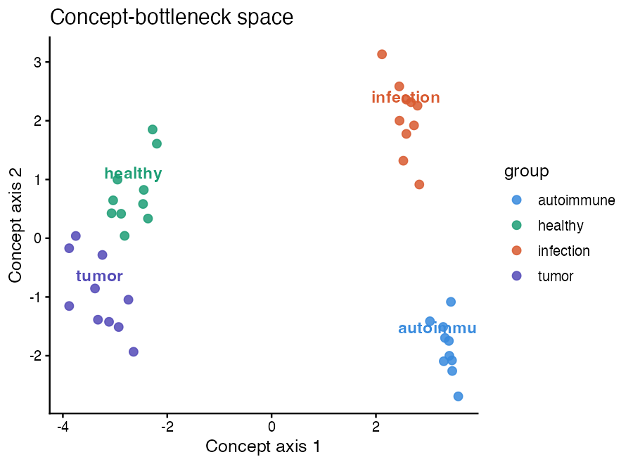
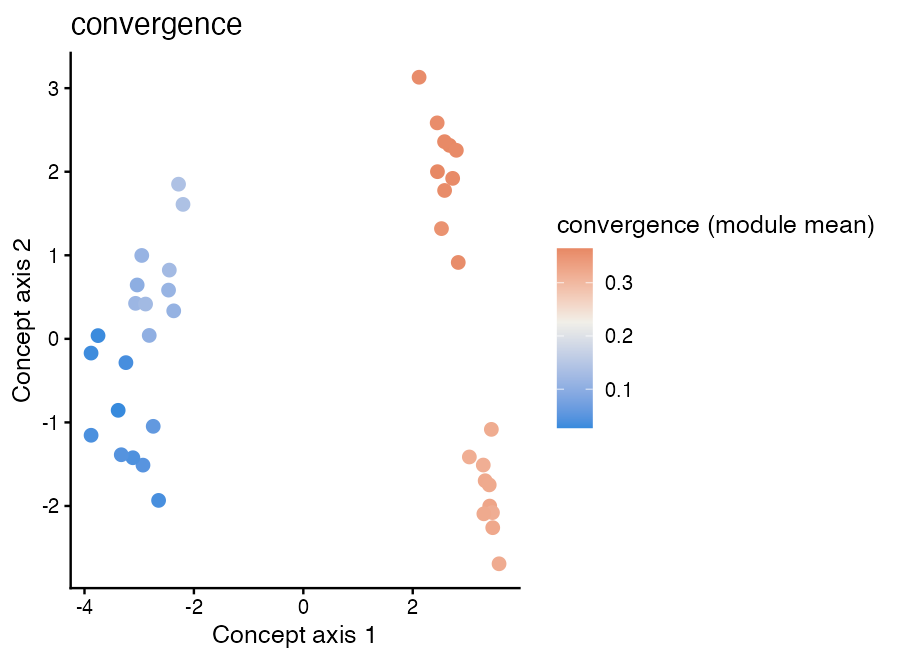
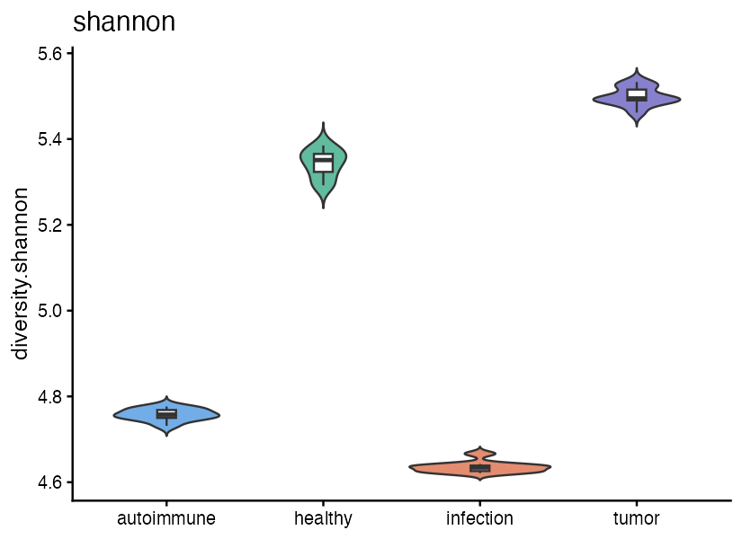
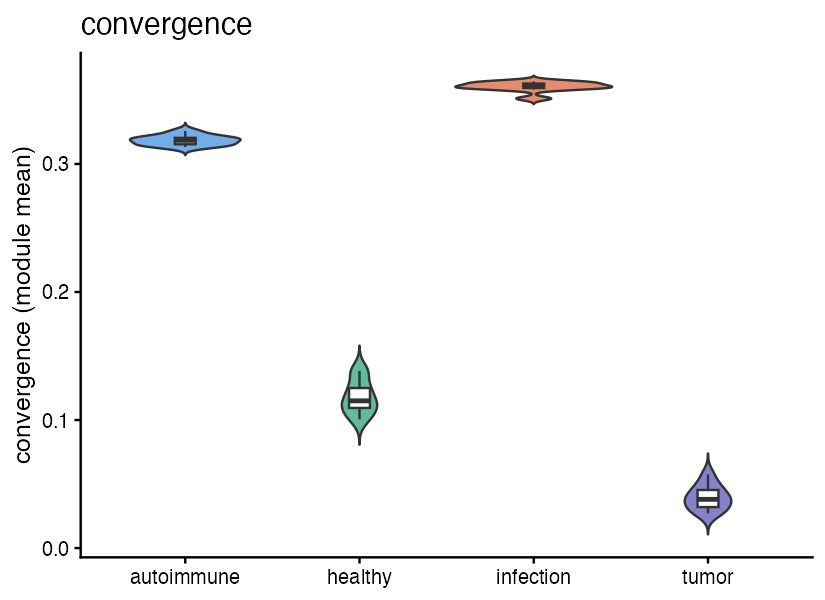
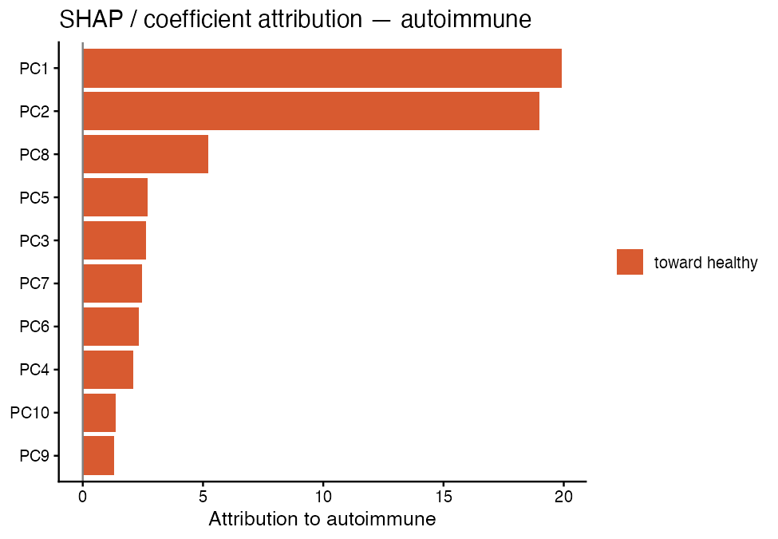
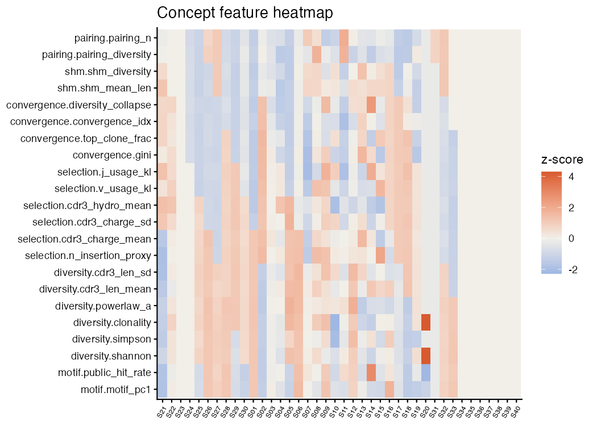
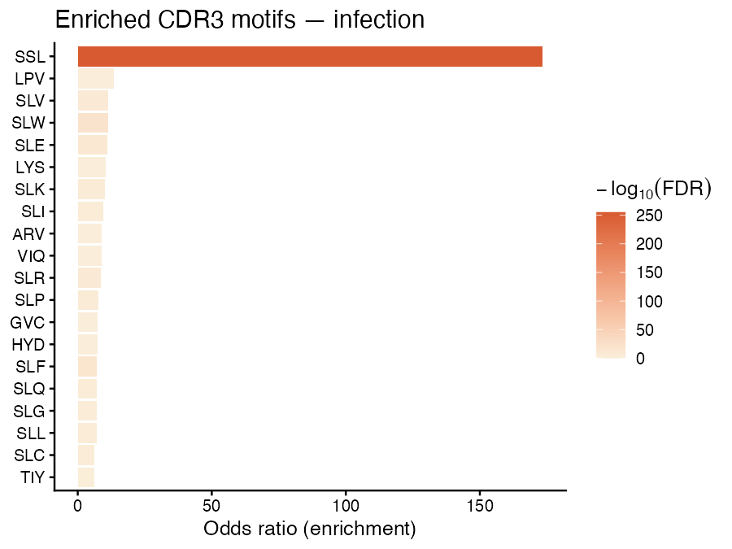
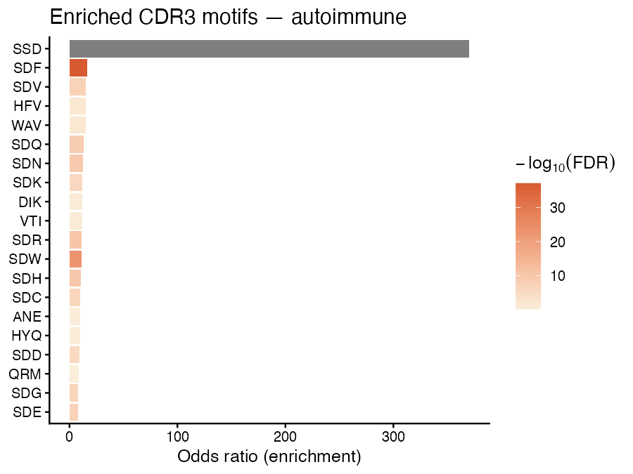

# CDRscope

**Interpretable TCR/BCR repertoire analysis via a six-concept bottleneck.**

`CDRscope` implements the five-layer interpretable algorithm architecture for
TCR/BCR immune repertoires. It compiles six research directions into six
interpretable concept axes, builds a concept-bottleneck embedding space,
separates diseases with explainable classifiers (linear / tree + SHAP), and
discovers biomarkers at both statistical and sequence levels — all wrapped in
a single `CDRobject` carried through a Seurat-style piped workflow.

```
ReadRepertoire → QCRepertoire → ComputeFeatures → ConceptBottleneckEmbed
              → DiseaseClassify → FindMarkers
```

## Six concept axes

| Module | Direction | Key features |
|--------|-----------|--------------|
| `motif` | ① Antigen decoding | CDR3 3-mer spectrum, public-clonotype hit rate |
| `diversity` | ② Repertoire statistics | Shannon, Simpson, clonality, power-law α |
| `selection` | ③ Selection imprint | N-insertion proxy, charge, hydrophobicity, V/J KL |
| `convergence` | ④ Disease perturbation | Gini, top-clone fraction, convergence index, collapse |
| `shm` | ⑤ History & lineage | SHM burden proxy (BCR) |
| `pairing` | ⑥ Chain pairing | Pairing diversity (single-cell) |

## Demo results (toy data, 4 disease groups)

Disease separation in the concept-bottleneck space:



Feature on the concept space (convergence index):



Feature distributions by group:

 

SHAP / coefficient attribution to the disease class:



Concept-feature heatmap:



Enriched CDR3 motifs per disease group:

 

Marker tables: [`statistical_markers.csv`](docs/statistical_markers.csv) · [`sequence_markers_top100.csv`](docs/sequence_markers_top100.csv)

Reproduce with `Rscript demo_analysis.R`.

## Installation

```r
# from local source
install.packages("CDRscope", repos = NULL, type = "source")
```

Suggested packages unlock optional features: `httr` (online VDJdb fetch),
`iml` (SHAP), `entropy` / `poweRlaw` (extra diversity), `umap`.

## Quick start

```r
library(CDRscope)

obj <- fetch_toy_data()                      # toy repertoire (offline)
obj <- QCRepertoire(obj)
obj <- NormalizeRepertoire(obj)
obj <- ComputeFeatures(obj)
obj <- ConceptBottleneckEmbed(obj)
obj <- DiseaseClassify(obj, use_shap = TRUE)
obj <- FindMarkers(obj, level = "both")

DimPlot(obj)              # disease separation in concept space
SHAPPlot(obj)             # attribution to concept axes
VlnPlot(obj, "shannon")   # feature by group
head(obj@markers$statistical_sig)
head(obj@markers$sequence_sig)
```

## Online data

```r
vdjdb <- fetch_vdjdb(species = "HomoSapiens", gene = "TRB", limit = 5000)
```

## Design notes

- **Object**: `CDRobject` is an S4 class with slots `meta`, `clones`,
  `features`, `feature_modules`, `embedding`, `reduction`, `classification`,
  `markers`, `misc` — modelled after `Seurat`.
- **Interpretability**: the concept-bottleneck layer forces every disease
  decision through the six named modules; SHAP attributes decisions to axes.
- **Markers**: statistical level (feature differences + FDR) localises the
  perturbed mechanism; sequence level (motif enrichment + public disease
  clonotypes) gives concrete CDR3 biomarkers.

License: MIT
